# TrueRental User Guide

TrueRental is a **desktop** application for managing your client details, **optimized** for use via a Command Line
Interface (CLI) while still having the benefits of a Graphical User Interface (GUI). 

TrueRental prioritises **productivity** and **efficiency**.

TrueRental can get your client management tasks done **much faster** than traditional GUI apps, due to minimal mouse
movements and distractions.

Our application allows you to perform multiple operations that suits your needs as a **Letting Agent**, such as:

1. Adding new clients
2. Updating existing clients
3. Removing outdated clients
4. Filtering clients based on needs
5. Import and Export client details

This project is built on top of [AddressBook-Level3 Project](https://se-education.org/). Special thanks and appreciation
for the team of AddressBook-Level 3.

## Table of Contents
<page-nav-print />

## Quick Start

1. Ensure you have Java `17` or above installed in your Computer.

2. Download the latest `.jar` file from [here](https://github.com/AY2425S1-CS2103T-T15-1/tp/releases).

3. Copy the file to the folder you want to use as the _home folder_ for your TrueRental application.

4. Open a command terminal, `cd` into the folder you put the jar file in, and use the `java -jar truerental.jar` command
   to run the application. 
   <box type="info" seamless>
   Note: A GUI similar to the image below should appear in a few seconds. The image below consist of existing sample
   data. 
   </box>

   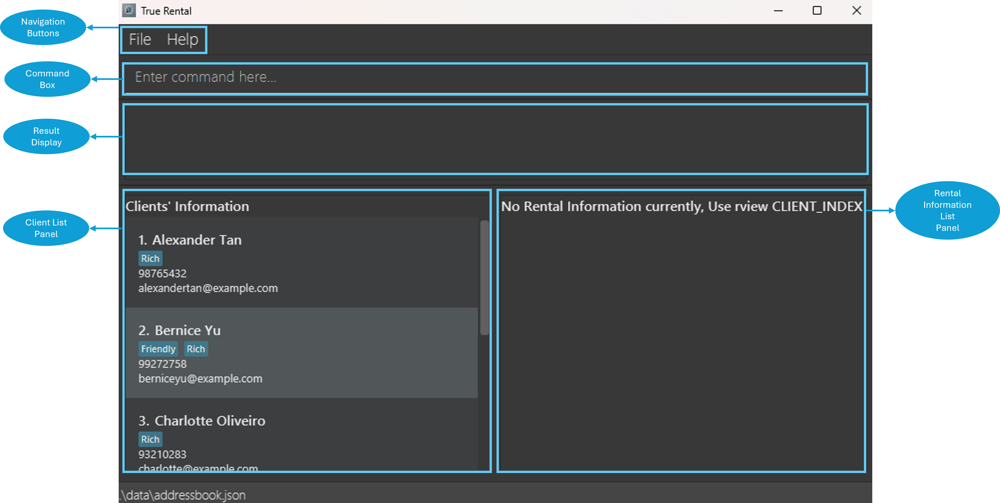
5. Type the command in the command box and press Enter to execute it. E.g. Typing **`help`** in the command box and
   pressing enter will open the help window. 

6. **Simple and Quick Tutorial**:

    1. `cadd n/Steven Tan e/steventan@tutorial.com p/98765432`: Adds a client named `Steven Tan` to TrueRental with
       email `steventan@tutorial.com` and phone number `98765432`.

    2. `list`: Lists all clients. There should be 6 clients listed within the TrueRental application.

    3. `cdelete 3`: Deletes the 3rd client shown in the current list, namely client called `Charlotte Oliveiro`. 
       Enter `y`: Yes for confirmation to the operation.

    4. `clear`: Deletes every client and their associated rental information from TrueRental application. 
       Enter `y`: Yes for confirmation to the operation.

    5. `exit`: Exits the application.

<!--TODO: Screenshots of tutorial run down AFTER sample data has been updated in the application -->

7. Refer to the [Command Summary](#command-summary) for a quick overview of available commands.

8. Refer to the [Features](#features) for details of each command.

--------------------------------------------------------------------------------------------------------------------

## Important Notes

<box type="info" seamless>

**Notes:** 

* Commands are **case-sensitive** and show always be **lowercase**. 
  E.g. `help`, `cadd`, `cedit`, `list`.

* Words in `UPPER_CASE` are the **parameters** to be supplied by the user. 
  E.g. in `cadd n/NAME`, `NAME` is a parameter which can be used as `add n/John Doe`.

* Items without brackets are **mandatory**, you must provide a value. 
  E.g. `n/NAME` for `cadd`, `CLIENT_INDEX` and `a/ADDRESS` for `radd`.

* Items in square brackets `[]` are **mandatory** to have **at least one of them**, you should not omit all of them in a command. 
  E.g `cedit` can be used as `cedit 1 n/Steven Tan e/steventan@abc.com p/98765432` or `cedit 1 n/Steven Tan p/98765432`.

* Items in curly brackets `{}` are **optional**, you may choose not to have them in your command. 
  E.g. `radd` can be used as `radd 1 a/140 Robinson Road, #03-05, Chow House`
  or `radd 1 a/140 Robinson Road, #03-05, Chow House m/3200 dd/10 d/0`.

* Items with `...`​ after them can be used multiple times. 
  E.g. `k/KEYWORDS` for `find` can be used as `find k/Steven Tan k/98765432` (2 times), `find k/98765432` (1 time), etc.

* Parameters can be in any order. 
  E.g. if the command specifies `n/NAME p/PHONE_NUMBER`, `p/PHONE_NUMBER n/NAME` is also acceptable.

* There should be spaces between every parameter option flag  E.g. `n/James Tan e/jamestan@example.com`.

* Extraneous parameters for commands that do not take in parameters (such as `help`, `list`, `exit`, `sort` and `clear`)
  will be ignored. 
  E.g. if the command specifies `help 123`, it will be interpreted as `help`.

* If you are using a PDF version of this document, be careful when copying and pasting commands that span multiple lines
  as space characters surrounding line-breaks may be omitted when copied over to the application.

</box>

<box type="info" seamless>

**Notes about this user guide:** 

- Please refer to this user guide whenever you feel something is wrong with the application to determine whether it is a genuine problem.
- The **client** referred to in this user guide is the property owner or landlord who has engaged you to rent out and manage their property.
- The **rental information** referred to in this user guide consists of the details of the property being rented, including key information for example address, rental start date, and other relevant property details.
- The **customer** (as part of the rental information) referred to in this user guide is the tenant of the property managed by the client.
- **Monthly rent** is equivalent to **monthly rent amount**.
- **Deposit** is equivalent to **deposit amount**.
- **Customer list** is equivalent to **customers**.
- **Rent due date** is equivalent to **rental monthly payment date**.

</box>

## Command Summary

<box type="tip" seamless>

**Tip**: Refer to respective features within [Features](#features) for a better understanding of each commands.

</box>

<d-table>

| Commands                                                                    | Description                             | Format                                                                                                                                                       | Examples                                                         |
|-----------------------------------------------------------------------------|-----------------------------------------|--------------------------------------------------------------------------------------------------------------------------------------------------------------|------------------------------------------------------------------|
| [**help**](#viewing-help-help)                                              | Show manual                             | `help`                                                                                                                                                       | -                                                                |
| [**cadd**](#adding-a-client-cadd)                                           | Add a client                            | `cadd n/NAME [p/PHONE_NUMBER] [e/EMAIL] {t/TAG...}`                                                                                                          | `cadd n/Steven Tan e/steventan@abc.com p/98765432`               |
| [**radd**](#adding-a-rental-information-for-a-client-radd)                  | Add rental information to a client      | `radd CLIENT_INDEX a/ADDRESS {s/RENTAL_START_DATE} {e/RENTAL_END_DATE} {dd/RENT_DUE_DATE} {m/MONTHLY_RENT} {d/DEPOSIT} {cl/CUSTOMER_LIST}`                   | `radd 1 a/Blk 26 Defu Lane 10 #01-190 e/31/10/2024 m/2350 dd/15` |
| [**list**](#listing-all-clients-list)                                       | List all clients                        | `list`                                                                                                                                                       | -                                                                |
| [**rview**](#listing-rental-information-of-a-client-rview)                  | View rental information of a client     | `rview CLIENT_INDEX`                                                                                                                                         | `rview 1`                                                        |
| [**cedit**](#editing-a-client-cedit)                                        | Edit a client                           | `cedit CLIENT_INDEX [n/NAME] [p/PHONE_NUMBER] [e/EMAIL] [t/TAG...]`                                                                                          | `cedit 1 n/Steven Tan e/steventan@abc.com p/98765432`            |
| [**redit**](#editing-a-client-s-rental-information-redit)                   | Edit rental information for a client    | `redit CLIENT_INDEX r/RENTAL_INDEX [a/ADDRESS] [s/RENTAL_START_DATE] [e/RENTAL_END_DATE] [dd/RENT_DUE_DATE] [m/MONTHLY_RENT] [d/DEPOSIT] [cl/CUSTOMER_LIST]` | `redit 1 r/1 a/10 North Bridge Rd #02-5125 m/3000 d/0`           |
| [**find**](#locating-clients-find)                                          | Find information                        | `find [k/KEYWORDS...] [n/NAME...] [p/PHONE_NUMBER...] [e/EMAIL...] [t/TAG...]`                                                                               | `find k/Tan n/Steven Tan p/98765432`                             |
| [**cdelete**](#deleting-a-client-cdelete)                                   | Delete a client                         | `cdelete CLIENT_INDEX`                                                                                                                                       | `cdelete 3`                                                      |
| [**rdelete**](#deleting-a-rental-information-rdelete)                       | Delete rental information from a client | `rdelete c/CLIENT_INDEX r/RENTAL_INDEX`                                                                                                                      | `rdelete c/1 r/2`                                                |
| [**sort**](#sorting-all-entries-sort)                                       | Sort clients by name                    | `sort`                                                                                                                                                       | -                                                           |
| [**↑up↓down arrow keys**](#command-history-up-arrow-key-and-down-arrow-key) | Navigate command history                | `↑ up-arrow key` and `↓ down-arrow key`                                                                                                                      | -                                                                |
| [**↹ Tab key**](#autofill-tab-key)                                          | Autofill value                          | `↹ Tab key`                                                                                                                                                  | -                                                                |
| [**import**](#importing-data-import)                                        | Import data from an external file       | `import`                                                                                                                                                     | -                                                                |
| [**export**](#exporting-data-export)                                        | Export all TrueRental's data            | `export`                                                                                                                                                     | -                                                                |
| [**clear**](#clearing-all-entries-clear)                                    | Clear all client's details'             | `clear`                                                                                                                                                      | -                                                                |
| [**exit**](#exiting-the-application-exit)                                   | Exit the application                    | `exit`                                                                                                                                                       | -                                                                |

</d-table>

## Parameter Constraints Table

<d-table>

| Parameter name      | Description                                                                                                                             | Constraints                                                                                                                                                                                                                                                                                                                                                                                                                                                                                                                                                                                                                                                                                                                                                                                                                                                                                     | Examples                                                   | 
|---------------------|-----------------------------------------------------------------------------------------------------------------------------------------|-------------------------------------------------------------------------------------------------------------------------------------------------------------------------------------------------------------------------------------------------------------------------------------------------------------------------------------------------------------------------------------------------------------------------------------------------------------------------------------------------------------------------------------------------------------------------------------------------------------------------------------------------------------------------------------------------------------------------------------------------------------------------------------------------------------------------------------------------------------------------------------------------|------------------------------------------------------------|
| `NAME`              | Client's name                                                                                                                           | `Alphanumeric Characters`                                                                                                                                                                                                                                                                                                                                                                                                                                                                                                                                                                                                                                                                                                                                                                                                                                                                       | `Jason 1 Lee`, `Phua Chu Kang 2`, `123456789`              |
| `PHONE_NUMBER`      | Client's phone number                                                                                                                   | `At least 3 Numeric Characters` without spaces.                                                                                                                                                                                                                                                                                                                                                                                                                                                                                                                                                                                                                                                                                                                                                                                                                                                 | `999`, `98123333`, `123123`                                |
| `EMAIL`             | Client's email address                                                                                                                  | Two segments delimited by `@`.   **First** segment to include `Alphanumeric` with optionally `+_.-` characters.   **Second** segment to include `Alphanumeric` with optionally `-` character but to include a valid top-level domain (TLD).   **Both** segments must only start with `Alphanumeric` characters excluding `_` and must not contain spaces.                                                                                                                                                                                                                                                                                                                                                                                                                                                                                                                           | `jasonlee@example.com`, `user.name+tag@example.com`        |
| `TAG`               | Client's tags                                                                                                                           | Only accepts `alphanumeric characters` without spaces.                                                                                                                                                                                                                                                                                                                                                                                                                                                                                                                                                                                                                                                                                                                                                                                                                                          | `FRIENDS`, `ANNOYING`, `LOVERBOY`                          |
| `ADDRESS`           | The address of the property managed by your client.                                                                                     | The value of `ADDRESS` can consist of any combination of `Unicode` characters, with a minimum length of one character.                                                                                                                                                                                                                                                                                                                                                                                                                                                                                                                                                                                                                                                                                                                                                                          | `59 Ubi Ave 1 #06-05`, `18 Upper Boon Keng Road #01-1137`  |
| `RENTAL_START_DATE` | The specific date (including day, month, and year) on which the rental period for the property, under your client's management, begins. | The value of `RENTAL_START_DATE` can be empty (no value is provided after the prefix `s/` for the specified command), in which case it will be treated as an unspecified value (`—`). However, if the value of `RENTAL_START_DATE` is not empty (a value is provided after the prefix `s/` for the specified command), it must adhere to the following conditions: **1.** It must be in the format `dd/mm/yyyy`, where `dd` represents the day, `mm` represents the month, and `yyyy` represents the year. **2.** It must represents a valid date and fall within the range of `01/01/1900` to `31/12/2099`. **3.** If the value of `RENTAL_END_DATE` is also specified and not empty, then the date represented by the value of `RENTAL_START_DATE` should be the same date or earlier than the date represented by the value of `RENTAL_END_DATE`.                                | `01/01/2024`, `01/06/2024`                                 |
| `RENTAL_END_DATE`   | The specific date (including day, month, and year) on which the rental period for the property, under your client's management, ends.   | The value of `RENTAL_END_DATE` can be empty (no value is provided after the prefix `e/` for the specified command), in which case it will be treated as an unspecified value (`—`). However, if the value of `RENTAL_END_DATE` is not empty (a value is provided after the prefix `e/` for the specified command), it must adhere to the following conditions: **1.** It must be in the format `dd/mm/yyyy`, where `dd` represents the day, `mm` represents the month, and `yyyy` represents the year. **2.** It must represents a valid date and fall within the range of `01/01/1900` to `31/12/2099`. **3.** If the value of `RENTAL_START_DATE` is also specified and not empty, then the date represented by the value of `RENTAL_END_DATE` should be the same date or later than the date represented by the value of `RENTAL_START_DATE`.                                    | `31/12/2027`, `01/02/2026`                                 |
| `RENT_DUE_DATE`     | The specific day (of the month) on which the rent payment is due for the property managed by your client.                               | The value of `RENT_DUE_DATE` can be empty (no value is provided after the prefix `dd/` for the specified command), in which case it will be treated as an unspecified value (`—`). However, if the value of `RENT_DUE_DATE` is not empty (a value is provided after the prefix `dd/` for the specified command), it must adhere to the following conditions: **1.** It must be an integer within the range of `1` to `31`. **2.** It must not have leading zeroes (for example, `01` or `001` are not valid).                                                                                                                                                                                                                                                                                                                                                                          | `1`, `15`, `30`                                            |
| `MONTHLY_RENT`      | The monthly rent amount for the property managed by your client.                                                                        | The value of `MONTHLY_RENT` can be empty (no value is provided after the prefix `m/` for the specified command), in which case it will be treated as an unspecified value (`—`). However, if the value of `MONTHLY_RENT` is not empty (a value is provided after the prefix `m/` for the specified command), it must adhere to the following conditions:  **1.** It must be a number greater than or equal to 0. **2.** If it is a decimal, it must have exactly 2 decimal places (for example, `100.`, `100.0` or `100.001` are not valid). **3.** It must not have leading zeroes (for example, `0100` or `00100` are not valid).                                                                                                                                                                                                                                                 | `1000`, `1000.00`, `0`                                     |
| `DEPOSIT`           | The security deposit amount for the property managed by your client, paid by the tenant at the start of the lease.                      | The value of `DEPOSIT` can be empty (no value is provided after the prefix `d/` for the specified command), in which case it will be treated as an unspecified value (`—`). However, if the value of `DEPOSIT` is not empty (a value is provided after the prefix `d/` for the specified command), it must adhere to the following conditions:  **1.** It must be a number greater than or equal to 0. **2.** If it is a decimal, it must have exactly 2 decimal places (for example, `100.`, `100.0` or `100.001` are not valid). **3.** It must not have leading zeroes (for example, `0100` or `00100` are not valid).                                                                                                                                                                                                                                                           | `2000`, `2000.00`, `0`                                     |
| `CUSTOMER_LIST`     | The name(s) of the tenant(s) for the property managed by your client.                                                                   | The value of `CUSTOMER_LIST` can be empty (no value is provided after the prefix `cl/` for the specified command), in which case it will be treated as an unspecified value (`—`). However, if the value of `CUSTOMER_LIST` is not empty (a value is provided after the prefix `cl/` for the specified command), it must adhere to the following conditions: **1.** It can consist of any combination of `Unicode` characters. **2.** It must have a length of at least one character. **3.** If it does not contain a `;` character (semicolon), it represents the name of a single tenant. **4.** If it contains the `;` character(s) (semicolon), it is treated as a list of tenant names, with each name separated by a `;` and name cannot be empty. **5.** If it contains the `;` character(s) (semicolon), `;` should not appear at the beginning or end of the value. | `David Ng`, `Steven Ang 2;David Tan`, `123, Dexter;Joshua` |
| `CLIENT_INDEX`      | Client index on the client list panel                                                                                                   | Only accepts `Positive Integer` up till the `last index` shown on the list                                                                                                                                                                                                                                                                                                                                                                                                                                                                                                                                                                                                                                                                                                                                                                                                                      | `1`                                                        |
| `RENTAL_INDEX`      | Rental index on the rental information list panel                                                                                       | Only accepts `Positive Integer` up till the `last index` shown on the list                                                                                                                                                                                                                                                                                                                                                                                                                                                                                                                                                                                                                                                                                                                                                                                                                      | `1`                                                        |

</d-table>

<box type="warning" light>

**Additional constraints:** For future enhancements and improvements to the parameter constraints, please visit
our [developer guide](https://ay2425s1-cs2103t-t15-1.github.io/tp/DeveloperGuide.html#appendix-future-enhancements).

</box>

## Duplicate Client Detection

A client is only considered as **duplicate** **if and only if** all three parameters `[NAME]`, `[PHONE_NUMBER]`
and `[EMAIL_ADDRESS]` are **exactly the same** (including case sensitivity).

This is to allow the user to have a greater flexibility of manipulating the client's information.

**For example:** All the clients stated below the initial client are **NOT CONSIDERED** as duplicates.

<box type="info" light>

An **initial client** with the name: `Jason Lee`, phone number: `91231231` and email address `jasonlee@example.com`

</box>

<box type="success" light>

**Not Duplicates:**

1. A client with the name: `Jason Lee`, phone number: `99998888` and email address `jasonlee@example.com`.
2. A client with the name: `Jason Lee`, phone number: `91231231` and email address `NOTjasonlee@example.com`.
3. A client with the name: `Jason Lee`, phone number: `—` and email address `jasonlee@example.com`.
4. A client with the name: `Jason Lee`, phone number: `91231231` and email address `—`.
5. A client with the name: `JASON LEE`, phone number: `91231231` and email address `jasonlee@example.com`.

<box type="info" seamless>

**Note:** `-` signifies an empty parameter without any characters.

</box>

</box>

<box type="wrong" light>

**Duplicates:**

1. A client with the name: `Jason Lee`, phone number: `91231231` and email address `jasonlee@example.com`.

</box>

## Duplicate Rental Information Detection

Rental information is considered a **duplicate** **if and only if** the `ADDRESS` parameter is **exactly the same**, including case sensitivity.

This is to allow you to have a greater flexibility of manipulating the rental information.

**For example:**

<box type="info" light>

An **initial rental information** with the address `201 Bukit Batok Street 21 #10-163`, rental start date `01/01/2024` and monthly rent amount `3200`. The values for rental end date, rent due date, deposit amount, and customer list are unspecified.

</box>

<box type="success" light>

The following are **NOT DUPLICATES** of the initial rental information:

1. Rental information with the address `201 BUKIT BATOK STREET 21 #10-163`, rental start date `01/01/2024` and monthly rent amount `3200`. The values for rental end date, rent due date, deposit amount, and customer list are unspecified (as `—`).
2. Rental information with the address `201 BUKIT Batok Street 21 #10-163`, rental start date `01/01/2024` and monthly rent amount `3500`. The values for rental end date, rent due date, deposit amount, and customer list are unspecified (as `—`).
3. Rental information with the address `201 Bukit BATOK Street 21 #10-163`, rental start date `01/01/2024`, monthly rent amount `3200` and rental end date `31/12/2024`. The values for rent due date, deposit amount, and customer list are unspecified (as `—`).
4. Rental information with the address `201 BuKiT BaToK StReEt 21 #10-163`, rental start date `01/01/2024`, monthly rent amount `3200`, rental end date `31/12/2024`, rent due date `10`. The values for deposit amount and customer list are unspecified (as `—`).
5. Rental information with the address `201 bukit batok street 21 #10-163`, rental start date `01/06/2024` and monthly rent amount `3200`. The values for rental end date, rent due date, deposit amount, and customer list are unspecified (as `—`).

</box>

<box type="wrong" light>

The following are **DUPLICATES** of the initial rental information:

1. Rental information with the address `201 Bukit Batok Street 21 #10-163`, rental start date `01/02/2024` and monthly rent amount `3300`. The values for rental end date, rent due date, deposit amount, and customer list are unspecified.
2. Rental information with the address `201 Bukit Batok Street 21 #10-163` and rental start date `01/12/2024`. The values for monthly rent amount, rental end date, rent due date, deposit amount, and customer list are unspecified.

</box>

--------------------------------------------------------------------------------------------------------------------

## Features

### Viewing help : `help`

<!--TODO: MAKE ALL DESCRIPTIONS BIGGER-->
Displays a message with a link that directs you to the TrueRental website.

Format: `help`

<box type="tip" seamless>

**Tip:** Alternatively, you can press the button at the top of the navigation button bar to view the help page, or
simply press `f11`.

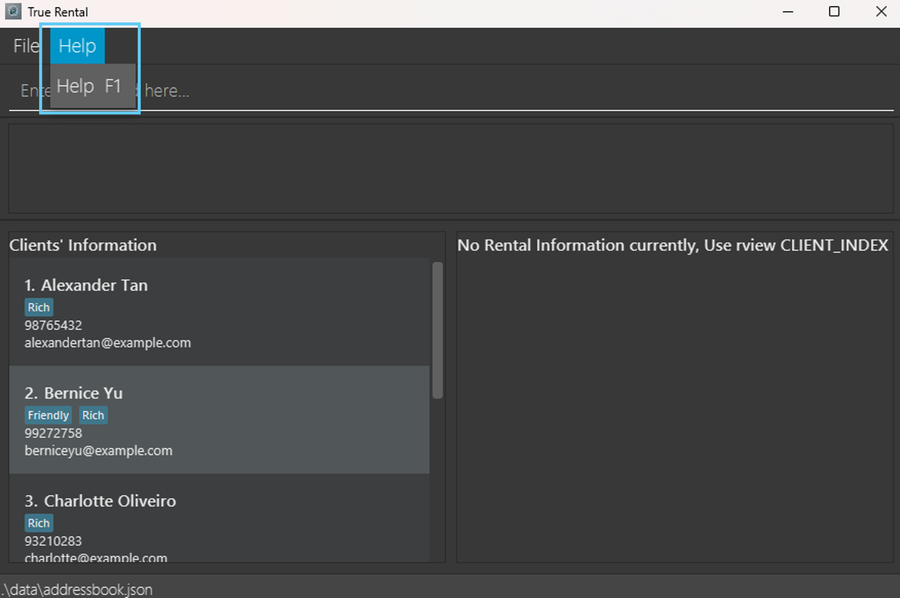

</box>

  

### Adding a client: `cadd`

Adds a client to TrueRental.

Format: `cadd n/NAME [p/PHONE_NUMBER] [e/EMAIL] {t/TAG}…​`

<box type="important" seamless>

**Constraints:**

1. A client must have at least **either** **one phone number** or **one email address**.

</box>

<box type="tip" seamless>

**Tip:**

1. A client can have any number of tags, ranging from 0 to infinity.
2. A client's name with special characters, such as `Ravi S/O Ramasamy` will not be accepted.  
   Please omit any special characters within the name, such as `Ravi SO Ramasamy`.

</box>

<box type="info" light>

**Example inputs**:

1. `cadd n/John Doe p/98765432 e/johnd@example.com`
2. `cadd n/Clarice Long e/claricelong@example.com`
3. `cadd n/Betsy Crowe e/betsycrowe@example.com t/North t/Friend`

</box>

<box type="success" light>

**Example outputs**:

1. `New client added: John Doe; Phone: 98765432; Email: johnd@example.com`
2. `New client added: Clarice Long; Email: claricelong@example.com`
3. `New client added: Betsy Crowe; Email: betsycrowe@example.com; Tags: [Friend][North]`

</box>

  

### Adding a rental information for a client: `radd`

Adds a rental information for the specific client to TrueRental.

Format: `radd CLIENT_INDEX a/ADDRESS {s/RENTAL_START_DATE} {e/RENTAL_END_DATE} {dd/RENT_DUE_DATE} {m/MONTHLY_RENT} {d/DEPOSIT} {cl/CUSTOMER_LIST}`

<box type="important" seamless>

**Constraints:**

* The `CLIENT_INDEX` refers to the index number shown in the displayed client list and must be a positive integer
  starting from 1.
* The value of **address** for the rental information cannot be empty.

</box>

<box type="info" light>

**Example inputs**:

1. `radd 1 a/140 Robinson Road, #03-05, Chow House m/3200 dd/10 d/0`
2. `radd 1 a/Blk 26 Defu Lane 10 #01-190 e/31/10/2024 m/2350 dd/15 cl/Dominic`
3. `radd 3 a/25 Jalan Sempadan #02-06 s/01/09/2024 e/31/08/2025 cl/Steven Lim;Jessica dd/20 m/2750 d/8250`

</box>

<box type="success" light>

**Example outputs**:

1. `New rental information is added to the client: Address: 140 Robinson Road, #03-05, Chow House; Rental Start Date: —; Rental End Date: —; Rent Due Date: 10; Monthly Rent: $3200.00; Deposit: $0.00; Customer List: —`
2. `New rental information is added to the client: Address: Blk 26 Defu Lane 10 #01-190; Rental Start Date: —; Rental End Date: 31 Oct 2024; Rent Due Date: 15; Monthly Rent: $2350.00; Deposit: —; Customer List: Dominic`
3. `New rental information is added to the client: Address: 25 Jalan Sempadan #02-06; Rental Start Date: 01 Sep 2024; Rental End Date: 31 Aug 2025; Rent Due Date: 20; Monthly Rent: $2750.00; Deposit: $8250.00; Customer List: Steven Lim;Jessica`

</box>

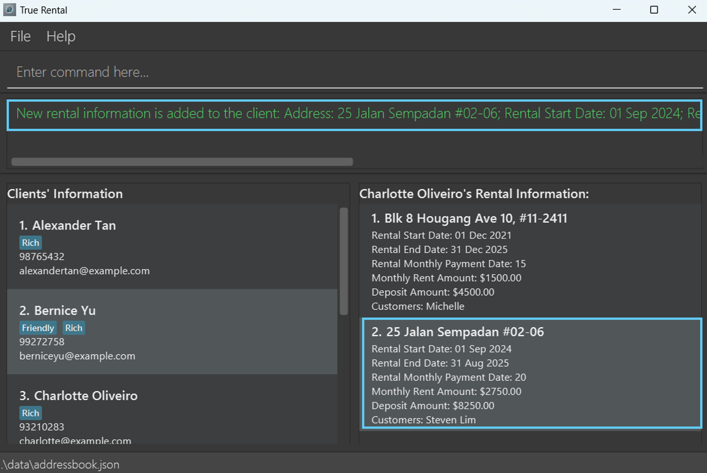

  

### Listing all clients : `list`

Displays a list of all clients within TrueRental in a table format on the Client List Panel.

Format: `list`

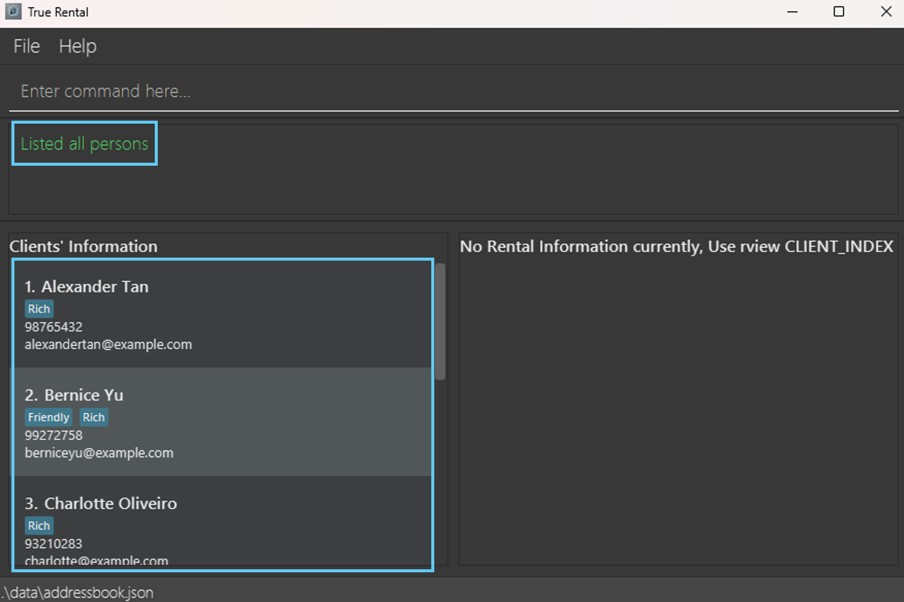

  

### Listing rental information of a client : `rview`

Displays a list of all rental information related to a specific client within TrueRental.

Format: `rview CLIENT_INDEX`

<box type="info" seamless>

**Note:** Displays all rental information related to the client at the specified `CLIENT_INDEX`.

</box>

<box type="important" seamless>

**Constraints:** The `CLIENT_INDEX` refers to the index number shown in the displayed client list and must be a positive
integer starting from 1.

</box>

<box type="info" light>

**Example inputs**:

1. `rview 1`  
2. `rview 2`  

</box>

<box type="success" light>

**Example outputs**:

1. `2 rentals listed!`, while displaying the updated rental information on the rental information list panel.
2. `1 rental listed`, while displaying the updated rental information on the rental information list panel.

</box>

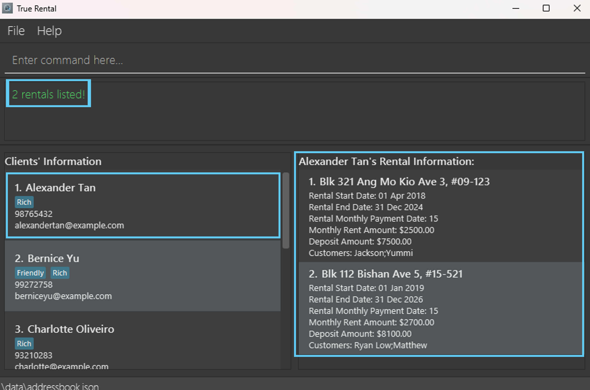

  

### Editing a client : `cedit`

Edits an existing client with TrueRental. The provided input will replace the existing input, subjected to the parameter
constraints.
<!-- TODO: Hyperlink paramter constraints to the table at the top -->

Format: `cedit CLIENT_INDEX [n/NAME] [p/PHONE_NUMBER] [e/EMAIL] [t/TAG]…​`

<box type="important" seamless>

**Constraints:**

* The `CLIENT_INDEX` refers to the index number shown in the displayed client list and must be a positive number.
* The range starts from `1` till the last number shown within the list.
* A client **name** cannot be empty.
* A client must have at least **either** **one phone number** or **one email address**.
* A client's `NAME`, `PHONE_NUMBER` and `EMAIL` will be replaced by the provided value in the command, given that it is
  not a [duplicate](#duplicate-client-detection).
* All the client's existing `TAG`s will be removed and replaced by the provided value in the command.
  
</box>

<box type="tip" seamless>

**Tip:**

* You can **remove** a client's existing phone number or email address by providing an empty input after `p/` or `e/`
  respectively.
* You can **remove** all the client's existing tags by providing an empty input after `t/`.
* A client's name with special characters, such as `Ravi S/O Ramasamy` will not be accepted. Please omit any special
  character within the name such as `Ravi SO Ramasamy`.
 
</box>

<box type="info" light>

**Example inputs**:

1. `cedit 1 p/91234567 e/alexandertanchongming@example.com`
2. `cedit 3 n/Chanel Oliveiro t/Rich t/Twin`
3. `cedit 2 p/`

</box>

<box type="success" light>

**Example outputs**:

1. `Edited Client: Alexander Tan; Phone: 91234567; Email: alexandertanchongming@example.com; Tags: [Rich]`
2. `Edited Client: Chanel Oliveiro; Phone: 93210283; Email: charlotte@example.com; Tags: [Rich][Twin]`
3. `Edited Client: Bernice Yu; Email: berniceyu@example.com; Tags: [Friendly][Rich]`

</box>

  

### Editing a client's rental information: `redit`

Edits a specific client's rental information in the address book.

Format: `redit CLIENT_INDEX r/RENTAL_INDEX [a/ADDRESS] [s/RENTAL_START_DATE] [e/RENTAL_END_DATE] [dd/RENT_DUE_DATE] [m/MONTHLY_RENT] [d/DEPOSIT] [cl/CUSTOMER_LIST]`

<box type="important" seamless>

**Constraints:**

* The `CLIENT_INDEX` refers to the index number shown in the displayed client list and must be a positive integer
  starting from 1.
* The `RENTAL_INDEX` refers to the client's rental index number shown in the displayed rental information list (
  run `rview CLIENT_INDEX` to display the rental information list) and must be a positive integer starting from 1.
* You cannot and should not edit the value of `ADDRESS` to be empty, as it is required to not be empty.
* Editing a parameter will remove its existing value and replace with the newly specified value.

</box>

<box type="tip" seamless>

**Tip:**

* You can **remove** the value of existing rental start date, rental end date, rent due date, monthly rent, deposit or
  customer list of the specified rental information by providing an empty value after `s/`, `e/`, `dd/`, `m/`, `d/`
  or `cl/` respectively.

</box>

<box type="info" light>

**Example inputs**:

1. `redit 1 r/1 a/10 North Bridge Rd #02-5125 m/3000 d/0`
2. `redit 1 r/2 e/31/12/2024 dd/1 cl/Alice;Bob`
3. `redit 3 r/1 s/01/01/2025 e/ d/12000 cl/Tan Eng Heng`

</box>

<box type="success" light>

**Example outputs**:

1. `Edited Client's Rental Information: Address: 10 North Bridge Rd #02-5125; Rental Start Date: 01 Apr 2018; Rental End Date: 31 Dec 2024; Rent Due Date: 15; Monthly Rent: $3000.00; Deposit: $0.00; Customer List: Jackson;Yummi`
2. `Edited Client's Rental Information: Address: Blk 112 Bishan Ave 5, #15-521; Rental Start Date: 01 Jan 2019; Rental End Date: 31 Dec 2024; Rent Due Date: 1; Monthly Rent: $2700.00; Deposit: $8100.00; Customer List: Alice;Bob`
3. `Edited Client's Rental Information: Address: Blk 8 Hougang Ave 10, #11-2411; Rental Start Date: 01 Jan 2025; Rental End Date: —; Rent Due Date: 15; Monthly Rent: $1500.00; Deposit: $12000.00; Customer List: Tan Eng Heng`

</box>

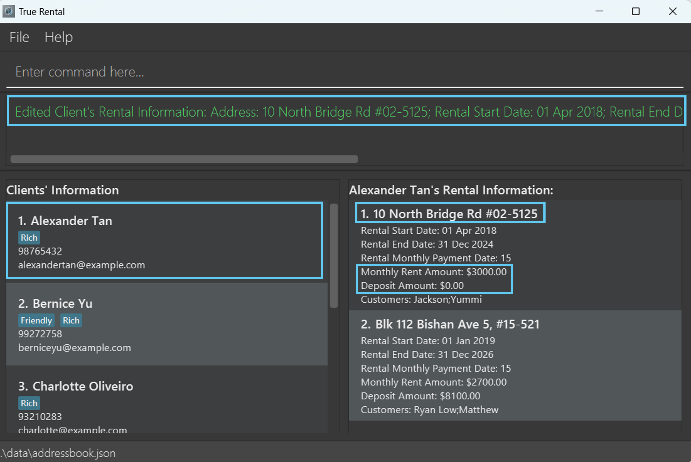

  

### Locating clients: `find`

Finds clients whose names contain any of the given keywords, name, email, phone or tag.

Format: `find [k/KEYWORD...] [n/NAME...] [p/PHONE_NUMBER...] [e/EMAIL...] [t/TAG...]`

<box type="important" seamless>

**Constraints**: Must contain at least one of the optional fields.

</box>

<box type="info" seamless>

**Note:** Utilising the **keyword** will perform a search for all clients for the matching keyword throughout all
information, including rental information.

</box>

<box type="tip" seamless>

**Tips:**

* The search is case-insensitive. e.g `hans` will match `Hans`.
* For `[k/KEYWORD]`, `[n/NAME]`, `[p/PHONE_NUMBER]` and `[e/EMAIL]`, partial input will be matched with any of the
  fields, if any.
   E.g. `Han` will match <code><b>Han</b>s</code>
* For `[t/TAG]` only the full input will be matched with a tag, if any.
   E.g. `Friend` will only match with `Friend`.
* Persons matching at least one keyword will be returned (i.e. `OR` search).
   E.g. `k/Hans k/Bo` will return `Hans Gruber`, `Bo Yang`

</box>

<box type="info" light>

**Example inputs**:

1. `find n/Alex`, finds any client with the matching characters `Alex` in their names.
2. `find k/12`, finds any client with the matching keyword `12` in any of their information.
3. `find t/Rich`, finds any client with the matching tag `Rich`.

</box>

<box type="success" light>

**Example outputs**:

1. `1 persons listed!`. It will return every client with the name containing `Alex`.
2. `2 persons listed!`. It will return every client with the keyword `12` within all its attributes.
3. `3 persons listed!`. It will return every client with the tag `Rich`.

</box>

  

### Deleting a client : `cdelete`

Deletes the specified client from TrueRental.

Format: `cdelete CLIENT_INDEX`

<box type="info" seamless>

**Note**:

* Confirmation required. Type `y` for **yes** and `n` for **no**.
* Deletes the client at the specified `CLIENT_INDEX` and all related rental information.
* The index refers to the index number shown in the displayed client list.
* The index **must be a positive integer** 1, 2, 3, …​

</box>

<box type="info" light>

**Example inputs:**:

1. `cdelete 7` to delete the client at index 7.
    * `y` to confirm deletion of the 7th client in the list.

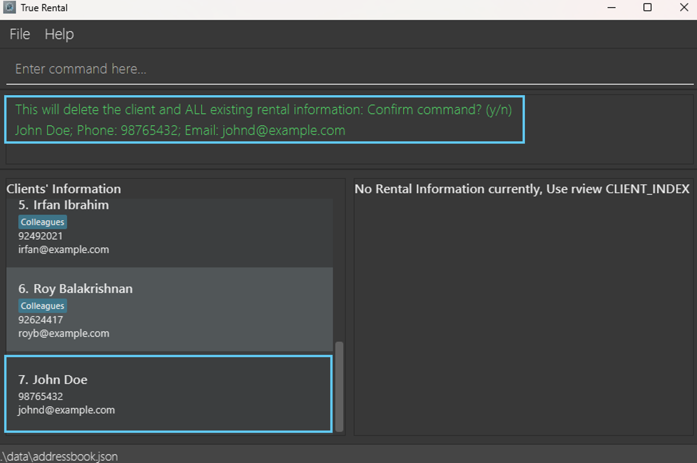

</box>

<box type="success" light>

**Examples outputs:**

1. `Deleted Client: John Doe; Phone: 98765432; Email: johnd@example.com`

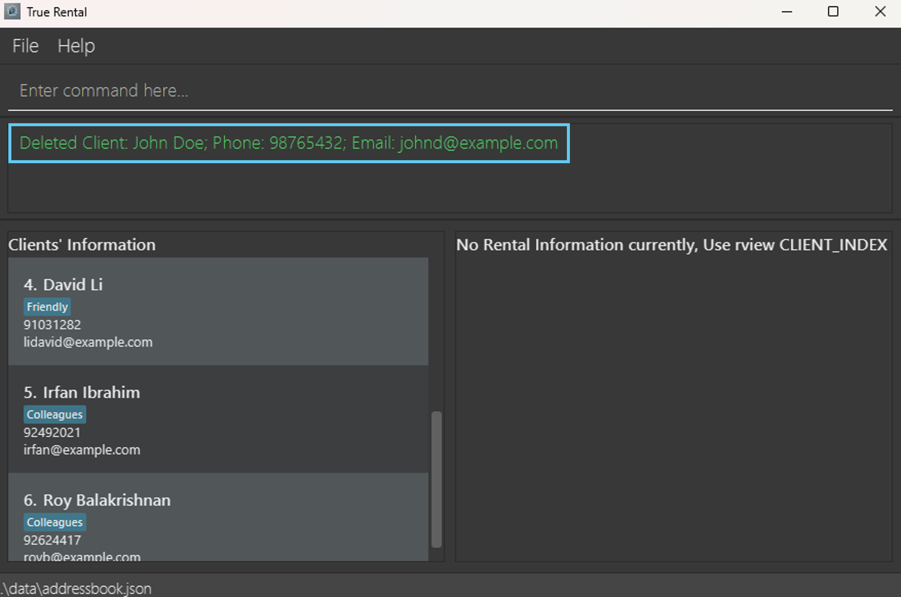

</box>

  

### Deleting a rental information : `rdelete`

Deletes the specified rental information from the specified client

Format: `rdelete c/CLIENT_INDEX r/RENTAL_INDEX`

<box type="info" seamless>

**Note**:

* Confirmation required. Type `y` for **yes** and `n` for **no**.
* Deletes the rental information at the specified `RENTAL_INDEX` from the client at the specified `CLIENT_INDEX`.
* `CLIENT_INDEX` refers to the index number shown in the displayed client list.
* `RENTAL_INDEX` refers to the index number shown in the displayed rental information list when the `rview` command is
  run. (i.e. `rview CLIENT_INDEX`)
* `CLIENT_INDEX` and `RENTAL_INDEX` **must be positive integers** 1, 2, 3, …​

</box>

<box type="success" light>

**Examples**:

* `list` followed by `rdelete c/2 r/1` deletes the 1st rental information from the 2nd client in the address book.
* `find Betsy` followed by `rdelete c/1 r/2` deletes the 2nd rental information from the 1st client in the results of
  the `find` command.

</box>

### Sorting all entries : `sort`

Sorts all entries in the application according to name in alphabetical order.

Format: `sort`

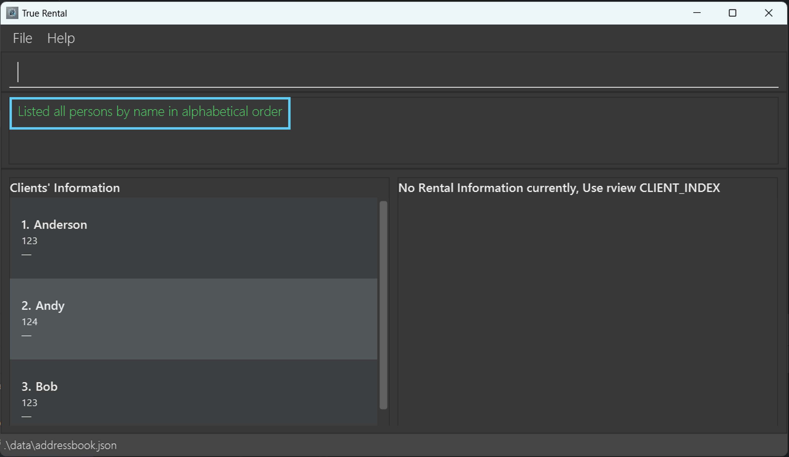

  

### Command History: `↑ up-arrow key` and `down-arrow key`

Navigates through all previously entered commands.

1. Entering the `↑ up-arrow key` will revisit the **previous** command in the command history.
2. Entering the `↓ down-arrow key` will revisit the **next** command in the command history.

<box type="important" seamless>

**Constraints:**

* If there are no more previous commands, it will display the last command within the command history in the command
  box.
* If there are no more next commands, it will display an empty command in the command box.

</box>

<box type="info" seamless>

**Note:**

* All commands within the command history will be cleared upon exiting the TrueRental application.
* Only TrueRental specific commands will be stored within the command history.

</box>

<box type="info" theme="warning" light>

**Example Set-up:** (Steps 1 to 6 are performed sequentially)

Please set up the following commands before proceeding with the example inputs and outputs.

1. `cadd n/John Doe p/99887766 e/johndoe@example.com`
2. `radd 1 a/BLK 1 Bishan s/01/01/2024 e/31/12/2024 dd/15 m/2700 d/8100 cl/Steven;David`
3. `cadd n/Amy Tan p/99887766`
4. `rview 1`
5. `list`
6. `cdelete 2`

</box>

<box type="info" light>

**Example Inputs:** (Steps 1 to 13 are performed sequentially)

1. Press `↑ up-arrow key` on the keyboard.
2. Press `↑ up-arrow key` on the keyboard.
3. Press `↑ up-arrow key` on the keyboard.
4. Press `↑ up-arrow key` on the keyboard.
5. Press `↑ up-arrow key` on the keyboard.
6. Press `↑ up-arrow key` on the keyboard.
7. Press `↑ up-arrow key` on the keyboard. 
8. Press `↓ down-arrow key` on the keyboard.
9. Press `↓ down-arrow key` on the keyboard.
10. Press `↓ down-arrow key` on the keyboard.
11. Press `↓ down-arrow key` on the keyboard.
12. Press `↓ down-arrow key` on the keyboard.
13. Press `↓ down-arrow key` on the keyboard.

</box>

<box type="success" light>

**Example Outputs:** (Steps 1 to 13 are performed sequentially)

1. Expected: `cdelete 2` is shown in the command box.
2. Expected: `list` is shown in the command box.
3. Expected: `rview 1` is shown in the command box.
4. Expected: `cadd n/Amy Tan p/99887766` is shown in the command box.
5. Expected: `radd 1 a/BLK 1 Bishan s/01/01/2024 e/31/12/2024 dd/15 m/2700 d/8100 cl/Steven;David` is shown in
   the command box.
6. Expected: `cadd n/John Doe p/99887766 e/johndoe@example.com` is shown in the command box.
7. Expected: `cadd n/John Doe p/99887766 e/johndoe@example.com` is still shown in the command box, because there
   are no more previous commands.
8. Expected: `radd 1 a/BLK 1 Bishan s/01/01/2024 e/31/12/2024 dd/15 m/2700 d/8100 cl/Steven;David` is shown in the
   command box.
9. Expected: `cadd n/Amy Tan p/99887766` is shown in the command box.
10. Expected: `rview 1` is shown in the command box.
11. Expected: `list` is shown in the command box.
12. Expected: `cdelete 3` is shown in the command box.
13. Expected: : Nothing is shown in the command box.

</box>

  

### Autofill: `↹ Tab key`

Autofills command name, prefix and value of prefix.

Entering the `↹ Tab key` will help to fill or append to the command input with appropriate value.

<box type="important" seamless>

**Constraints:**

* The available value for autofill depends on the helping words specified by TrueRental (please refer to the **List of helping words** after **Note** for all available helping words).
* Autofill is not customized for every single prefix, all prefixes will have same set of value for autofill.

</box>

<box type="info" seamless>

**Note:**
* You should not rely on autofill too much as this feature is meant to provide some simple helps only, may not be fully accurate.
* Autofill only help you to get "started" with typing.
* Autofill for prefix is not fully customized for each command, it may have extra prefix that is not used by the command.
* Autofill for prefix may not be working for some commands which does not require extra parameters such as `list`, or command that does not need prefix such as `cdelete`.

</box>

<box type="info" theme="warning" light>

**List of helping words** (separated by comma (,)):
1. For autofills for **command name**:
   * cadd, cdelete, cedit, clear, exit, export, find, help, import, list, radd, redit, rdelete, rview, sort.
2. For autofills for **prefix**:
   * e/, n/, p/, k/, t/, a/, cl/, d/, dd/, e/, m/, s/, c/, r/.
3. For autofills for **value of prefix**:
   * Block, Blk, Ave, Avenue, Tan, Lim, Lee, Ng, Ong, Wong, Goh, Chua, Chan, Koh, Teo, Ang, Yeo, Tay, Ho, Low, Toh, Sim, Chong, Chia, Seah, Sarah, Sofia, Sofea, Sophia, Hana, Hannah, Alyssa, Emily, Emma, Charlotte, Chloe, Alesha, Alicia, Amanda, Sofie, Sophie, Elizabeth, Natalie, Aisyah, Aishah, Olivia, Leia, Keira, Kiera, Haley, Haily, Megan, Ethan, Aden, Aiden, Aidan, Eden, Nathan, Nathaniel, Lucas, Isaac, Caleb, Evan, Matthew, Josh, Joshua, Adam, Asher, Jayden, Rayyan, Julian, Julien, Ian, Cayden, Kayden, Luke, Matthias, Matthew, George, Gabriel, Winston, block, BLOCK, BLK, AVE, AVENUE, Steven, David, Rayan, Ryan.

</box>

<box type="info" light>

**Example Inputs:** (Steps 1 to 12 are performed sequentially)

1. Enter `r` as the input command.
2. Press `↹ Tab key` on the keyboard.
3. Press `↹ Tab key` on the keyboard.
4. Press `↹ Tab key` on the keyboard.
5. Clear input command and enter `radd ` as the input command (take note of the white space at the end of the command
   input).
6. Press `↹ Tab key` on the keyboard.
7. Press `↹ Tab key` on the keyboard.
8. Press `↹ Tab key` on the keyboard.
9. Clear input command and enter `radd cl/J` as the input command.
10. Press `↹ Tab key` on the keyboard.
11. Press `↹ Tab key` on the keyboard.
12. Press `↹ Tab key` on the keyboard.

</box>

<box type="success" light>

**Example Outputs:** (Steps 1 to 12 are performed sequentially)

1. Value of the input command is now "r".
2. Value of the input command is now "radd".
3. Value of the input command is now "redit".
4. Value of the input command is now "rdelete".
5. Value of the input command is now "radd ".
6. Value of the input command is now "radd a/".
7. Value of the input command is now "radd cl/".
8. Value of the input command is now "radd d/".
9. Value of the input command is now "radd cl/J".
10. Value of the input command is now "radd cl/Josh".
11. Value of the input command is now "radd cl/Joshua".
12. Value of the input command is now "radd cl/Jayden".

</box>

  

### Importing data: `import`

Imports and overwrite all existing data from a `.json` file.

Format: `import`

<box type="important" seamless>

**Constraints**:

* Only `.json` files can be imported.
* The chosen file must have the correct format.

</box>

<box type="info" seamless>

**Note**:

* Importing data will delete all current data in the address book. It is recommended to back up the current data via
  the `export` command.
* Confirmation required. Type `y` for **yes** and `n` for **no**.
* A new window will be opened that prompts for a file. 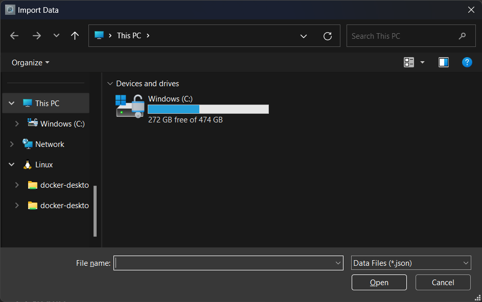

</box>

  

### Exporting data: `export`

Exports all data within TrueRental into a `.json` file.

Format: `export`

<box type="info" seamless>

**Note**: Confirmation required. Type `y` for **yes** and `n` for **no**.

</box>

<box type="info" seamless>

**Note**:

* Address book data can only be exported as `.json` files.
* A new window will be opened that prompts for a file. 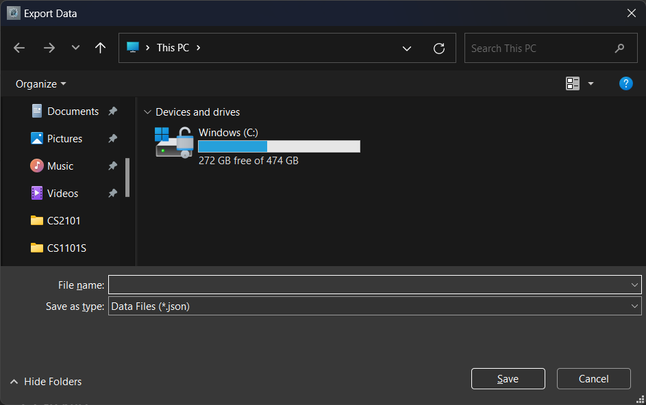

</box>

  

### Clearing all entries : `clear`

Clears all entries from TrueRental.

Format: `clear`

  

### Exiting the application : `exit`

Exits the program.

Format: `exit`

  

### Saving the data

AddressBook data are saved in the hard disk automatically after any command that changes the data. There is no need to
save manually.

### Editing the data file

AddressBook data are saved automatically as a JSON file `[JAR file location]/data/addressbook.json`. Advanced users are
welcome to update data directly by editing that data file.

<box type="warning" seamless>

**Caution:**
If your changes to the data file makes its format invalid, AddressBook will discard all data and start with an empty
data file at the next run. Hence, it is recommended to take a backup of the file before editing it. 
Furthermore, certain edits can cause the AddressBook to behave in unexpected ways (E.g. if a value entered is outside
the acceptable range). Therefore, edit the data file only if you are confident that you can update it correctly.

</box>

--------------------------------------------------------------------------------------------------------------------

## FAQ

**Q**: How do I transfer my data to another computer? 
**A**: Install the app in the other computer and overwrite the empty data file it creates with the file that contains the data of your previous AddressBook home folder.

--------------------------------------------------------------------------------------------------------------------

## Known issues

1. **When using multiple screens**, if you move the application to a secondary screen, and later switch to using only
   the primary screen, the GUI will open off-screen. The remedy is to delete the `preferences.json` file created by the
   application before running the application again.
2. **If you minimize the Help Window** and then run the `help` command (or use the `Help` menu, or the keyboard
   shortcut `F1`) again, the original Help Window will remain minimized, and no new Help Window will appear. The remedy
   is to manually restore the minimized Help Window.
